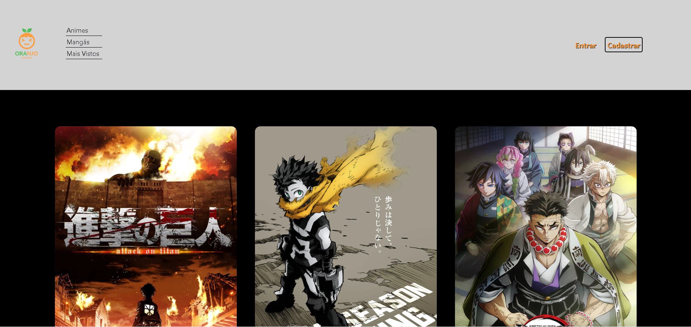
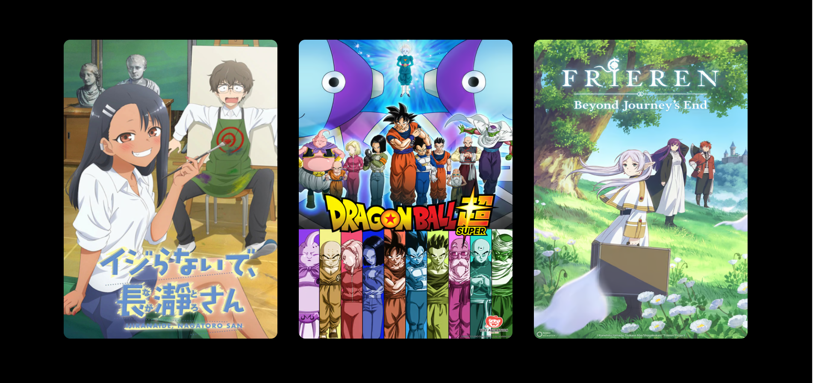
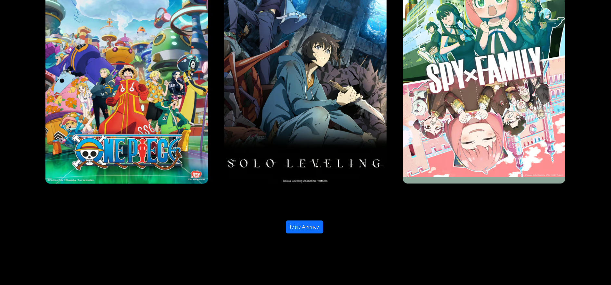
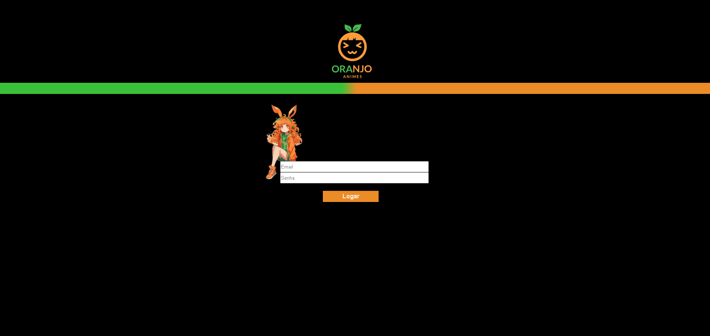

# Site de Animes Oranjo

Layout desenvolvido pelo grupo Arthur, Ben10, Davi e João:

## Objetivo

Este projeto tem o objetivo de demonstrar um site de videos com tema de animes.

## Funcionalidades

- Tema Escuro  
- Preview em tempo real
- Modo tela cheia
- Responsividade em andamento
- Recursos de JavaScript DOM
- Zoom ao encostar o mouse no card
- Expandir e recolher cards

## Screenshots

## Autores

- [@strosiiii](https://github.com/strosiiii)

